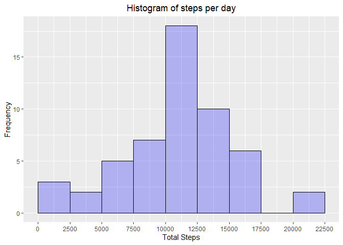
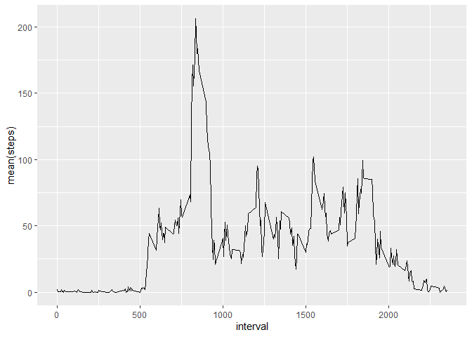
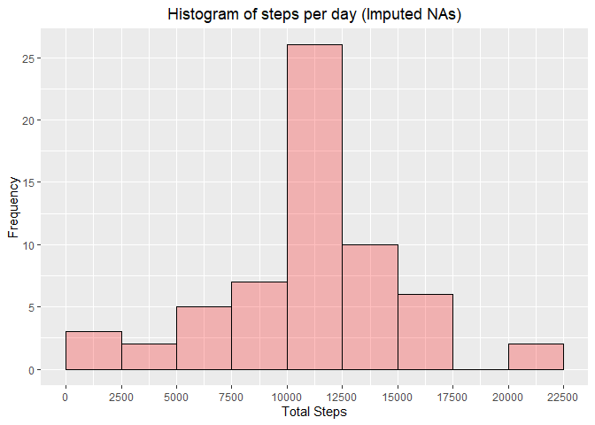
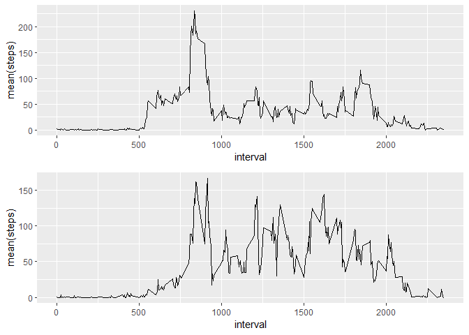

## Loading and preprocessing the data (library()/setwd() omitted for clarity)


```r
library(dplyr)
```

```
## Warning: package 'dplyr' was built under R version 4.0.5
```

```
## 
## Attaching package: 'dplyr'
```

```
## The following objects are masked from 'package:stats':
## 
##     filter, lag
```

```
## The following objects are masked from 'package:base':
## 
##     intersect, setdiff, setequal, union
```

```r
library(tidyr)
```

```
## Warning: package 'tidyr' was built under R version 4.0.5
```

```r
library(ggplot2)
```

```
## Warning: package 'ggplot2' was built under R version 4.0.5
```

```r
library(lubridate)
```

```
## Warning: package 'lubridate' was built under R version 4.0.5
```

```
## 
## Attaching package: 'lubridate'
```

```
## The following objects are masked from 'package:base':
## 
##     date, intersect, setdiff, union
```

```r
library(ggpubr)
```

```
## Warning: package 'ggpubr' was built under R version 4.0.5
```

```r
# Set setwd() to working directory containing data
setwd("C:/Users/nkd29/Desktop/Nikhils_Stuff/01_Career/03_Courses/Coursera_R_Data_Science_Johns_Hopkins/05_Repoducible_Research/Project_1/RepData_PeerAssessment1")
```


```r
list.files()
```

```
##  [1] "activity.csv"               "activity.zip"              
##  [3] "CourseProj1_N2.Rmd"         "CourseProj1_ND.html"       
##  [5] "CourseProj1_ND.md"          "CourseProj1_ND.Rmd"        
##  [7] "CourseProj1_ND_files"       "doc"                       
##  [9] "instructions_fig"           "PA1_template.Rmd"          
## [11] "Project1_Step_Monitoring.R" "README.md"
```

```r
data <- tbl_df(read.csv('activity.csv'))
```

```
## Warning: `tbl_df()` was deprecated in dplyr 1.0.0.
## Please use `tibble::as_tibble()` instead.
```

## What is mean total number of steps taken per day?


```r
# total steps per day
data_by_day <- data %>%  group_by(date)
tot_daily_steps <- summarise(data_by_day,sum(steps))


# histogram
ggplot(na.omit(tot_daily_steps), aes(x=`sum(steps)`)) + 
  geom_histogram(boundary = 0,
                 binwidth = 2500,
                 col='black',
                 fill='blue',
                 alpha=.25) +
  ggtitle('Histogram of steps per day') +
  xlab('Total Steps') +
  ylab('Frequency') +
  theme(plot.title = element_text(hjust=0.5)) +
  scale_x_continuous(breaks = seq(0,25000,2500)) +
  scale_y_continuous(breaks = seq(0,25,5))
```

<!-- -->

```r
# mean and median
mean(tot_daily_steps$`sum(steps)`, na.rm = TRUE)
```

```
## [1] 10766.19
```

```r
median(tot_daily_steps$`sum(steps)`, na.rm = TRUE)
```

```
## [1] 10765
```

## What is the average daily activity pattern?

```r
# time series plot
data_by_interval <- group_by(na.omit(data),interval)
avg_steps <- summarize(data_by_interval,mean(steps))

ggplot(avg_steps,aes(x=interval,y=`mean(steps)`)) + geom_line()
```

<!-- -->

```r
# Which 5-minute interval, on average across all the days in the dataset, contains the maximum 
# number of steps?
max_avg_steps <- max(avg_steps$`mean(steps)`)
max_avg_steps
```

```
## [1] 206.1698
```

```r
max_avg_int <- avg_steps$interval[match(max_avg_steps, avg_steps$`mean(steps)`)]
max_avg_int
```

```
## [1] 835
```

## Imputing missing values

```r
# get total number of NA values
tot_na <- sum(is.na(data$steps))
tot_na
```

```
## [1] 2304
```

```r
# add index column
data2 <- data %>% mutate(int_avg_index=match(data$interval, avg_steps$interval)) 

# use index to lookup calculated averages for each interval. Put into new column
data2$int_mean <- avg_steps$`mean(steps)`[data2$int_avg_index]

# replace only NA values with the looked up averages
data2$steps[which(is.na(data2$steps))] <- data2$int_mean
```

```
## Warning in data2$steps[which(is.na(data2$steps))] <- data2$int_mean: number of
## items to replace is not a multiple of replacement length
```

```r
# total steps per day
data_by_day2 <- data2 %>%  group_by(date)
tot_daily_steps2 <- summarise(data_by_day2,sum(steps))


# plot again: histogram
# ggplot(data2, aes(x=steps)) + geom_histogram()

ggplot(na.omit(tot_daily_steps2), aes(x=`sum(steps)`)) + 
  geom_histogram(boundary = 0,
                 binwidth = 2500,
                 col='black',
                 fill='red',
                 alpha=.25) +
  ggtitle('Histogram of steps per day (Imputed NAs)') +
  xlab('Total Steps') +
  ylab('Frequency') +
  theme(plot.title = element_text(hjust=0.5)) +
  scale_x_continuous(breaks = seq(0,25000,2500)) +
  scale_y_continuous(breaks = seq(0,25,5))
```

<!-- -->

```r
# mean and median: 
mean(tot_daily_steps2$`sum(steps)`)
```

```
## [1] 10766.19
```

```r
median(tot_daily_steps2$`sum(steps)`)
```

```
## [1] 10766.19
```

## Are there differences in activity patterns between weekdays and weekends?

```r
data2$day <- wday(ymd(data2$date),label=TRUE)

# data2$is_wknd <- ifelse(data2$day=)
data2$wknd <- ifelse(data2$day == "Sat"|data2$day=="Sun","weekend","weekday")

data2_by_int_wday <- data2 %>% filter(wknd=="weekday") %>% group_by(interval) %>% summarise(mean(steps))
data2_by_int_wknd <- data2 %>% filter(wknd=="weekend") %>% group_by(interval) %>% summarise(mean(steps))

data2_by_int_wday
```

```
## # A tibble: 288 x 2
##    interval `mean(steps)`
##       <int>         <dbl>
##  1        0        2.25  
##  2        5        0.445 
##  3       10        0.173 
##  4       15        0.198 
##  5       20        0.0990
##  6       25        1.59  
##  7       30        0.693 
##  8       35        1.14  
##  9       40        0     
## 10       45        1.80  
## # ... with 278 more rows
```

```r
data2_by_int_wknd
```

```
## # A tibble: 288 x 2
##    interval `mean(steps)`
##       <int>         <dbl>
##  1        0       0.215  
##  2        5       0.0425 
##  3       10       0.0165 
##  4       15       0.0189 
##  5       20       0.00943
##  6       25       3.51   
##  7       30       0.0660 
##  8       35       0.108  
##  9       40       0      
## 10       45       0.559  
## # ... with 278 more rows
```

```r
p_wday <- ggplot(data2_by_int_wday,aes(x=interval,y=`mean(steps)`)) + geom_line()

p_wknd <- ggplot(data2_by_int_wknd,aes(x=interval,y=`mean(steps)`)) + geom_line()

ggarrange(p_wday,p_wknd,ncol=1,nrow=2)
```

<!-- -->

